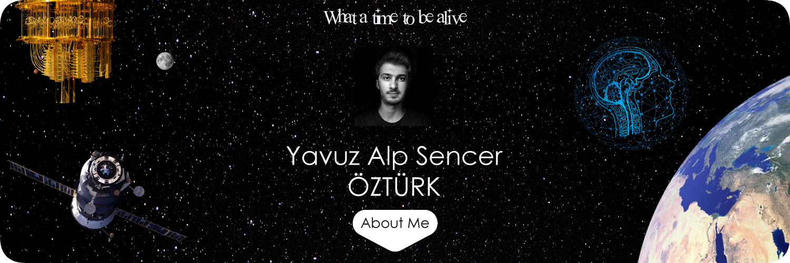

## Hi there 👋
I am,
- 2nd year **Computer Science** student at **Bilkent University** 👨‍💻
- Software Developer Intern at TUBITAK BILGEM
- Co-founder of [Syntex UAV](https://alpsencer.com/projects/teknofest/) 🚁

### Currently working on:
- Full stack web development
- Deep learning
- Generative AI
- Natural language processing
- LLMs

### My interests:
  #### Technical:
- Artificial Intelligence
- Machine Learning
- Computer Vision
- Linguistic and Natural Language processing
  #### Non-technical:
- Personal Knowledge Management Systems
- Science Fiction
- Philosophy
- Robotics

How to reach me:

<!--
**alpsencer/alpsencer** is a ✨ _special_ ✨ repository because its `README.md` (this file) appears on your GitHub profile.

Here are some ideas to get you started:

- 🔭 I’m currently working on ...
- 🌱 I’m currently learning ...
- 👯 I’m looking to collaborate on ...
- 🤔 I’m looking for help with ...
- 💬 Ask me about ...
- 📫 How to reach me: ...
- 😄 Pronouns: ...
- ⚡ Fun fact: ...
-->
