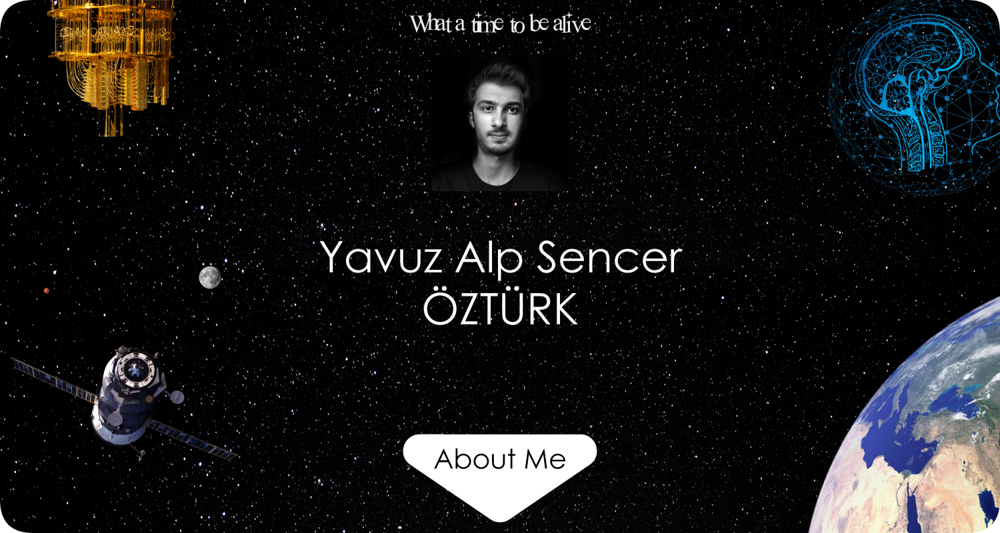

## Hi there 👋
I am,
1st year **Computer Science** student at **Bilkent University** 
Co-founder of [Gokordu UAV](gokordu.tech)

### Currently working on:
- Computer vision-guided tracker autonomous drones
- Real-time object detection and trackking
- Automation with Python
- Java programming

### My interests:
- Artificial Intelligence
- Machine Learning
- Quantum Computing
- Computer Vision
- Personal Knowledge Management Systems
- Science Fiction
- Philosophy
- Linguistic and Natural Language processing
- Robotics

How to reach me:

[]

<!--
**alpsencer/alpsencer** is a ✨ _special_ ✨ repository because its `README.md` (this file) appears on your GitHub profile.

Here are some ideas to get you started:

- 🔭 I’m currently working on ...
- 🌱 I’m currently learning ...
- 👯 I’m looking to collaborate on ...
- 🤔 I’m looking for help with ...
- 💬 Ask me about ...
- 📫 How to reach me: ...
- 😄 Pronouns: ...
- ⚡ Fun fact: ...
-->
